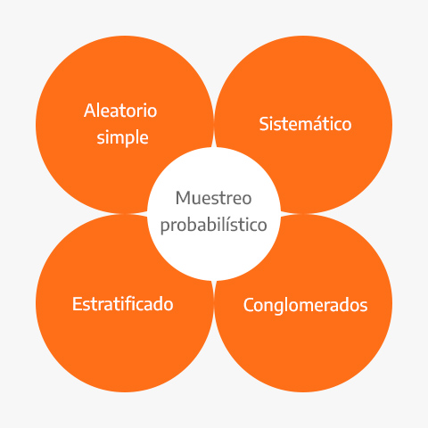
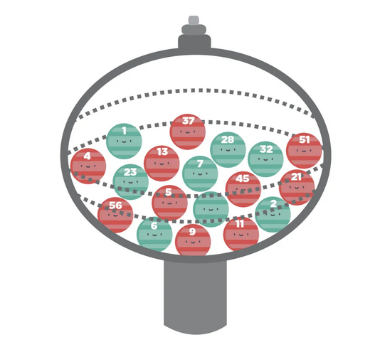

# Tipos de muestras

## ¿Qué es y para qué sirve muestreo?

El muestreo es el proceso de seleccionar un conjunto de individuos de una población con el fin de estudiarlos y poder caracterizar el total de la población. Nos ayuda a **obtener información fiable de la población a partir de una muestra** de la que extrae inferencias estadísticas con un margen de error medido en términos de probabilidades. En otras palabras, en una investigación por muestreo podremos estudiar el comportamiento y las opiniones de toda una población analizando únicamente una parte de esta, teniendo en cuenta que **siempre existirá un margen de error** a la hora de realizar dichos cálculos.

```{r, fig.align='center', out.height='450pt', out.width='450pt', echo=F}
knitr::include_graphics("img/01-muestreo/1-1-1-muestreo.jpg")
```

El aumento del uso de las técnicas de muestreo en la investigación es claro porque es un procedimiento
que **cuesta mucho menos dinero y consume menos tiempo**. Una muestra bien seleccionada de unos cuantos
miles de individuos puede representar con gran precisión una población de millones.


::: {.infobox .pin data-latex="{pin}"}
**¡¡ RECORDAR !!**

En comparación con un censo, una muestra bien diseñada puede lograr estimaciones de **alta calidad, en poco tiempo y a bajo costo** a costa de un **error de muestreo**, el cual puede ser **controlado.**
:::

## Ventajas e importancia de utilizar muestreo en el mundo corporativo

**Ventajas**

* **Reducción de costos:** Los costos de un estudio serán menores si los datos de interés se pueden obtener a partir de una muestra de la población. Por ejemplo, cuando se realizan estudios de prevalencia de un evento de interés, es más económico medir una muestra representativa de 1500 sujetos de una población, que el total de individuos que la componen.

* **Eficiencia:** Al trabajar con un número reducido de sujetos de estudio, representativos de la  población; el tiempo necesario para conducir el estudio y obtener resultados y conclusiones será notoriamente menor.


::: {.infobox .important data-latex="{important}"}
**Importancia**

No es posible ponerse en contacto con toda la población, por lo que solo se incluye una muestra o un subconjunto y se realiza una estimación estadística. **La muestra actúa de manera representativa de toda la población, controlando el márgen de error.**
:::


## ¿Qué se requiere para formular un problema de muestreo?

Es requisito fundamental de una buena muestra que las características de interés que existen en la
población se reflejen en la muestra de la manera más cercana posible. 
Esas características tienen que ver principalmente con el tamaño de la muestra y con la manera de obtenerla. 

Para esto se necesitan definir los siguientes conceptos:
  
* **Población objetivo:** Colección completa de todas las unidades que se quieren estudiar.

* **Marco de muestreo:** Listado de elementos que pertenecen a la población objetivo y son elegibles en la muestra.

* **Muestra:** Subconjunto de la población.

* **Unidad de muestreo:** Objeto a ser seleccionado en la muestra que permitirá el acceso a
la unidad de observación.

* **Unidad de observación:** Objeto sobre el que finalmente se realiza la medición.

* **Variable de interés:** Característica propia de los individuos sobre la que se realiza la
inferencia para resolver los objetivos de la investigación.

En la teoría de muestreo la variable de interés no se supone como una variable aleatoria sino como una
cantidad fija o una característica propia de las unidades que componen la población.

## Tipos de muestreo

Una muestra puede ser obtenida de diferentes maneras: 

* No probabilística.
  * Por cuotas
  * Conveniencia
  * Bola de nieve
  * Discrecional
  
* Probabilística
  * Aleatorio Simple
  * Sistemático
  * Estratificado
  * Conglomerados
  * Polietápico
  * Etc.

A continuación se definen y muestran las diferencias de estas técnicas de muestreo.

### Muestreo no probabilístico

Utiliza métodos en que **no interviene el azar**, por lo que se desconoce la probabilidad asociada a cada individuo para formar parte de la muestra. Normalmente estos métodos se utilizan en estudios exploratorios o intencionales, en los cuales no es necesario proyectar los resultados.

El inconveniente de este método es que **no puede asegurarse la representatividad de la muestra**.

Los sistemas de muestreo no probabilísticos se clasifican de la siguiente manera: 

```{r, fig.align='center', out.height='450pt', out.width='450pt', echo=F}

```


* **Muestreo por cuotas o cupos:** Si se conocen las características de la población a estudiar, **se elegirán los individuos respetando ciertas cuotas por edad, género, zona de residencia, entre otras que habrán sido prefijadas**.
Primero se realiza una clara división por cuotas (estratos) y posteriormente a cada cuota se aplica un muestreo discrecional.

Ejemplo: Seleccionar 20 estudiantes de la carrera de ingeniería industrial, que ya hayan cursado el noveno semestre de la carrera y que tengan promedio arriba del 6.5. Se eligen a los primeros 20 que cumplan con estas condiciones.
Este tipo de muestreo se utiliza especialmente en las encuestas de opinión. 

```{r, fig.align='center', out.height='250pt', out.width='450pt', echo=F}
knitr::include_graphics("img/01-muestreo/1-1-4-tipos-de-muestreo-no-probabilistico-cuotas.png")
```

* **Muestreo por conveniencia:** Las muestras de la población se seleccionan solo porque **están convenientemente disponibles para el investigador**. Es la técnica de muestreo no probabilística más común, debido a su velocidad, costo-efectividad y facilidad de disponibilidad de la muestra.

Ejemplo: Utilizar a estudiantes voluntarios que sean conocidos del investigador. El investigador puede enviar la encuesta a los estudiantes y ellos en este caso actuarían como muestra.

```{r, fig.align='center', out.height='250pt', out.width='450pt', echo=F}

```

* **Muestreo bola de nieve:** Se basa en **referencias de sujetos iniciales para generar sujetos adicionales**, de ahí deriva su nombre. Cuando se aplica este método de muestreo, los miembros del grupo de muestra se reclutan a través de una remisión en cadena. Estos pasos se repiten hasta que se encuentra el tamaño de muestra necesario. Éticamente, no se debe pedir a los participantes del estudio que identifiquen a otros participantes potenciales. Más bien, se les debe pedir que alienten a otros a que participen. 

Este muestreo consiste en dos partes: 

1. Identificar sujetos potenciales en la población. A menudo, sólo uno o dos sujetos pueden ser encontrados inicialmente.

2. Pedir a esos sujetos que recluten a otras personas. Los participantes deben ser conscientes de que no tienen que proporcionar ningún otro nombre.

Ejemplo: Realizar estudios con poblaciones marginales, tipos de enfermos, especialistas, etc.

```{r, fig.align='center', out.height='350pt', out.width='450pt', echo=F}
knitr::include_graphics("img/01-muestreo/1-1-4-tipos-de-muestreo-no-probabilistico-bola-nieve.png")
```

* **Muestreo discrecional:** La muestra es elegida a partir de un **criterio profesional y puede basarse en la experiencia de investigaciones** realizadas con anterioridad o en el conocimiento que el investigador tiene sobre la población. 

Es difícil estimar cuán cerca de la realidad se encuentra esta estimación. De hecho, la relevancia de los resultados depende de la experiencia del investigador.

Ejemplo 1: se desea realizar una investigación sobre el comportamiento de los padres con sus hijos. Por lo tanto, el investigador selecciona como muestra a personas que tengan hijos, ya que las considera aptas de conocimiento para formar parte de la investigación.

Ejemplo 2: Una prueba piloto podría realizarse a través de una muestra conformada por unidades de interés para el investigador que previamente sabe que puede poner a prueba el proceso de medición y los instrumentos de recolección de datos.

:::: {.center .infobox .important data-latex="important"}
¡¡¡ RECORDAR !!!

Los diseños de muestra no probabilísticos **NO TIENEN REPRESENTATIVIDAD ESTADÍSTICA**, por lo que **los resultados no pueden generalizarse** al resto de la población.
::::

### Muestreo probabilístico 

El muestreo probabilístico se define como aquél en que **todos los individuos de la población tienen una probabilidad de entrar a formar parte de la muestra**. Los diseños en que interviene el azar producen **muestras representativas** la mayoría de las veces. 

Los sistemas de muestreo probabilísticos de clasifican de la siguiente manera: 

```{r, fig.align='center', out.height='450pt', out.width='450pt', echo=F}

```

* **Muestreo aleatorio simple:** Se caracteriza porque **cada elemento de la población tiene la misma probabilidad  de  ser escogido para formar parte de la muestra** y todas las posibles muestras tienen la misma probabilidad de ser elegidas. Una vez censado el marco de la población, se asigna un número a cada individuo o elemento y se elige aleatoriamente.

Para seleccionar una muestra de este tipo se requiere tener en forma de lista todos los elementos que integran la población investigada y utilizar tablas de números aleatorios. 

Ejemplo: A un grupo de 100 personas se les numera de uno a cien y se depositan en una urna 100 canicas a su vez numeradas de uno a cien. Para obtener una muestra aleatoria simple de 20 elementos, tendríamos que sacar 20 canicas numeradas de la urna que nos seleccionarán en forma completamente aleatoria a los 20 elementos escogidos para que opinen sobre un nuevo producto.


```{r, fig.align='center', out.height='250pt', out.width='250pt', echo=F}

```

* **Muestreo sistemático:** Es susceptible de ser más preciso que el muestreo aleatorio simple. Se elige un primer elemento del universo y luego se van escogiendo otros **elementos igualmente espaciados a partir del primero**. Consiste en dividir la población en $n$ estratos, compuestos de $k$ unidades. 

Ejemplo: a partir de una lista de 100 establecimientos de comestibles, deseamos seleccionar una muestra probabilística de 25 tiendas. La forma de hacerlo sería: 

1. Dividir 100 entre 25 para obtener 4 tiendas que es el salto sistemático.

2. Extraer un número al azar entre 1 y 4. Supóngase que es el número 3 el cual corresponde al primer elemento seleccionado. 

3. Se incluyen en la muestra de establecimientos numerados: $3, 7, 11, 15$

```{r, fig.align='center', out.height='450pt', out.width='350pt', echo=F}

```

* **Muestreo estratificado:** En este tipo de muestreo **la población de estudio se divide en subgrupos o estratos**, escogiendo posteriormente una muestra al azar de cada estrato. Esta división suele realizarse según una característica que pueda influir sobre los resultados del estudio.

Si la estratificación se realiza respecto una característica se denomina *muestreo estratificado simple*, y si se realiza respecto a dos o más características sedenomina *muestreo estratificado compuesto*.

Ejemplo: Si existen 5 millones de hipertensos en una población y hay un $35\%$ de pacientes que fuman, podemos estratificar de manera que en nuestra muestra queden representados al igual que en el total de la población, la misma proporción de hipertensos fumadores ($35\%$) y de no fumadores ($65\%$).

```{r, fig.align='center', out.height='350pt', out.width='350pt', echo=F}
knitr::include_graphics("img/01-muestreo/1-1-4-tipos-de-muestreo-probabilistico-estratificado.jpg")
```

* **Muestreo por conglomerados:** El muestreo por conglomerados nos ayuda cuando es imposible o poco práctico crear un marco de muestreo de una población objetivo debido a que está muy **dispersa geográficamente** y el costo de la recopilación de datos es relativamente alto. Los elementos de la población son seleccionados al azar en forma natural por agrupaciones (clusters). Los elementos del muestreo se seleccionan de la población de manera individual, uno a la vez.  

La heterogeneidad del grupo es fundamental para un buen diseño del muestreo por conglomerados. Por otra parte, los elementos dentro de cada grupo debe ser tan heterogéneos como la población objetivo

Ejemplo: Una ONG quiere crear una muestra de niños en edad escolar primaria en 5 ciudades vecinas para obtener información sobre su nivel de educación.

```{r, fig.align='center', out.height='250pt', out.width='450pt', echo=F}

```

* **Muestreo poli-etápico:** Consiste en empezar a muestrear por algo que no constituye el objeto de la investigación (unidades primarias), y obtener una muestra dentro de cada una de ellas (unidades secundarias). Pueden utilizarse sucesivamente tantas etapas como sean necesarias, y en cada una de ellas, una técnica de muestreo diferente. Este método de muestreo se utiliza cuando la población de referencia es muy amplia y dispersa, ya que facilita la realización del estudio. 

* **Muestreo proporcional al tamaño de la población (PPT):** Método en el que la probabilidad de selección de una determinada unidad de muestreo es proporcional a su tamaño (generalmente el número de individuos u hogares que contiene la unidad de muestreo). En estas situaciones, si se utilizara el muestreo aleatorio para seleccionar las unidades de muestreo, los individuos de las mayores unidades de muestreo tendrían una probabilidad mucho menor de ser seleccionados que los de las unidades de muestreo más pequeñas

Ejemplo: Elegir primero hospitales y después de haberlos seleccionado, realizamos el muestreo de pacientes dentro de cada hospital. 

## Instrumentos de captura de datos

La **encuesta** es una técnica de recolección de datos que consta de una serie de preguntas estandarizadas hechas a una muestra representativa de la población de la que buscamos obtener información. Es una técnica útil para cualquiera que busque recopilar datos.

Asociado con cada elemento de la población existe una o más variables de interés. Una encuesta
permite conseguir información sobre características poblacionales desconocidas llamadas
*parámetros*. 

### Tipos de encuestas según la forma de aplicación

* **Encuesta por correo:** Consiste en enviar un cuestionario a través del servicio postal para que después de ser respondido, sea regresado al remitente.

```{r, fig.align='center', out.height='250pt', out.width='450pt', echo=F}

```

* **Encuesta por vía telefónica:** Consiste en realizar el cuestionario a través de una llamada telefónica, en la que el encuestador debe ir capturando las respuestas del encuestado. 

```{r, fig.align='center', out.height='350pt', out.width='350pt', echo=F}
knitr::include_graphics("img/01-muestreo/1-1-5-diferentes-formas-de-hacer-muestreo-telefono.png")
```

* **Encuesta personal:** Consiste en realizar el cuestionario cara a cara, debe existir una interacción entre encuestador y encuestado, normalmente el encuestador toma nota de las respuestas aunque en ocasiones solo entrega el cuestionario y es el encuestado quien lo llena. 

Una encuesta personal puede ser de dos tipos:

> De intercepción: el investigador suele ubicarse en espacios públicos como centros comerciales o parques para hacer una entrevista con preguntas concisas a personas que integran su muestra de estudio. 

> De puerta en puerta: En este tipo de encuestas, el investigador recorre casa por casa y solicita al participante tiempo para poder hacer aplicar el cuestionario. 

```{r, fig.align='center', out.height='250pt', out.width='450pt', echo=F}
knitr::include_graphics("img/01-muestreo/1-1-5-diferentes-formas-de-hacer-muestreo-encuesta.jpg")
```

* **Encuesta online:** Consiste en realizar el cuestionario utilizando el internet como medio de distribución, las encuestas online se caracterizan principalmente por ser económicas.

```{r, fig.align='center', out.height='250pt', out.width='450pt', echo=F}
knitr::include_graphics("img/01-muestreo/1-1-5-diferentes-formas-de-hacer-muestreo-online.jpg")
```

### Tipos de encuestas según las preguntas

* **Respuesta abierta:** estas permiten al encuestado tener la libertad de responder libremente cada pregunta, esto permite obtener respuestas más profundas y también obtener respuestas en las que no se había pensado, sin embargo, el problema de este tipo de encuestas es que es muy difícil de cuantificar, debido a que se deben interpretar las respuestas.

* **Respuesta cerrada:** en este tipo, los encuestados deberán elegir alguna de las posibles opciones, su principal ventaja es que son más fáciles de cuantificar, sin embargo, en ocasiones ninguna de las opciones refleja el pensamiento de los participantes, para ello, siempre es recomendable añadir la opción "*otro"*. 

* **Respuesta continua:** este tipo de respuestas toman un número incontable de valores, por ejemplo:
    * Edad
    * Salario
    * Número de personas que habitan en la casa


