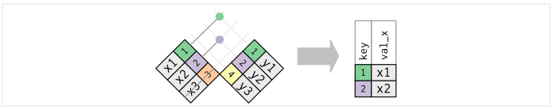
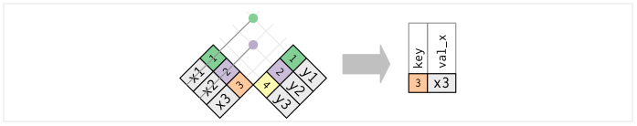
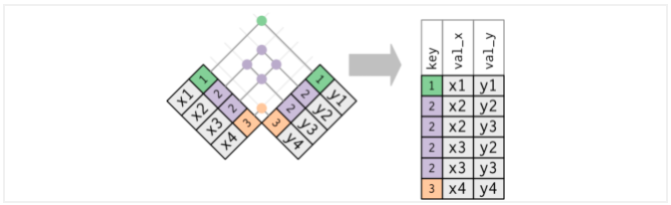

# Introducción a R

*R* (R Core Team) es un entorno y lenguaje de programación que permite el análisis estadístico de información y reportes gráficos. Es ampliamente usado en investigación por la comunidad estadística en campos como la biomedicina, minería de datos, matemáticas financieras, entre otros. Ha ganado mucha popularidad en los últimos años al ser un software libre que está en constante crecimiento por las aportaciones de otros usuarios y que permite la interacción con software estadísticos como STATA, SAS, SPSS, etc.. R permite la incorporación de librerías y paqueterías con funcionalidades específicas, por lo que es un lenguaje de programación muy completo y fácil de usar.

## ¿Cómo obtener *R*?

R puede ser fácilmente descargado de forma gratuita desde el sitio oficial <http://www.r-project.org/>. R está disponible para las plataformas Windows, Mac y Linux.

## ¿Qué es RStudio?

*RStudio* es un Entorno de Desarrollo Integrado (IDE, por sus siglas en inglés) para R. Este permite y facilita el desarrollo y ejecución de sintaxis para código en *R*, incluye una consola y proporciona herramientas para la gestión del espacio de trabajo. *RStudio* está disponible para Windows, Mac y Linux o para navegadores conectados a *RStudio Server o RStudio Server Pro*.

Algunas de las principales características de Rstudio que lo hacen una gran herramienta para trabajar en *R*, son:

-   Auto completado de código
-   Sangría inteligente
-   Resaltado de sintaxis
-   Facilidad para definir funciones
-   Soporte integrado
-   Documentación integrada
-   Administración de directorios y proyectos
-   Visor de datos
-   Depurador interactivo para corregir errores
-   Conección con Rmarkwon y Sweave

La siguiente imagen muestra la forma en la que está estructurado RStudio. El orden de los páneles puede ser elegido por el usuario, así como las características de tipo de letra, tamaño y color de fondo, entre otras características.

```{r, echo = F, out.width = "800px", out.height="450px", fig.align = "center", fig.cap= "Páneles de trabajo de Rstudio"}
knitr::include_graphics("img/02-intro2r/rstudio.png")
```

## *R* como lenguaje orientado a objetos

*R* es un lenguaje de programación orientado a objetos (POO). (López 2011, pag. 5) define a los objetos y sus características como "cualquier cosa con significado para el problema que se trata de resolver". A partir de esa definición, se puede decir que sirve para representar alguna entidad de la vida real, por lo general son componentes del problema que se pretende resolver y con los que podemos interactuar. A través de esta interacción y del estudio que se haga de ellos, es posible clasificarlos en grupos de acuerdo a sus caractrerísticas. A partir de los objetos con los que se trabaje, surgirán las clases adecuadas para encontrar la solución a un problema dado.

Los objetos tienen características fundamentales que permiten identificarlos, conocerlos y entender su comportamiento. De acuerdo con (Schildt 2009), estas características son:

1.  Identidad
2.  Comportamiento
3.  Estructura

-   **Identidad:** Esta es la propiedad que da nombre a cada uno de los objetos y que permite declararlos, distinguirlos de manera única, usarlos y llamarlos para la representación de su contenido.

-   **Comportamiento:** Esta es la propiedad que determina las operaciones que puede realizar el objeto, es decir, permite conocer las capacidades y alcances de la funcionalidad de cada objeto. El comportamiento permite conocer la interacción que puede existir con otros objetos y los resultrados que generarán.

-   **Estructura:** El estado se refiere a un conjunto de características o atributos específicos del objeto dados en un momento determinado, y que pueden cambiar en un instante de tiempo.

En la programación orientada a objetos, un programa recolecta muchos objetos para ser tratado como un conjunto dinámico de objetos interactuando entre sí. Los objetos están definidos por:

1.  **Atributos:** Son las propiedades o características de los datos contenidos en un objeto. Los valores asociados a un objeto en un momento determinado del tiempo determinan su estado.

2.  **Métodos:** Acceden a los atributos de los objetos y determinan el comportamiento de los datos contenidos.


## Estructuras de almacenamiento

---
Para este capítulo usaremos las notas de 'fhernanb': [Manual de R](https://fhernanb.github.io/Manual-de-R/intro.html)
---

En *R* existen varios tipos de objectos que permiten que el usuario pueda almacenar la información para realizar procedimientos estadísticos y gráficos. Los principales objetos en R son vectores, matrices, arreglos, marcos de datos y listas. A continuación se presentan las características de estos objetos y la forma para crearlos.

### Variables

Las variables sirven para almacenar un valor que luego vamos a utilizar en algún procedimiento.

Para hacer la asignación de un valor a alguna variable se utiliza el operador \<- entre el valor y el nombre de la variable. A continuación un ejemplo sencillo.

```{r}
x <- 5
(2 * x) + 3
```

En el siguiente ejemplo se crea la variable pais y se almacena el nombre Colombia, luego se averigua el número de caracteres de la variable pais.

```{r}
pais <- "Colombia"
nchar(pais)
```

También existen variables lógicas y estas toman los valores verdadero (TRUE) o falso (FALSE) dependiendo del resultado lógico puesto a prueba. Ejemplo:

```{r}
y <- 10
y == (5 + 3 + 2)

y != 5 + 5
```


### Vectores

Los vectores vectores son arreglos ordenados en los cuales se puede almacenar información de tipo numérico (variable cuantitativa), alfanumérico (variable cualitativa) o lógico (TRUE o FALSE), pero no mezclas de éstos. La función de *R* para crear un vector es c() y que significa concatenar; dentro de los paréntesis de esta función se ubica la información a almacenar. Una vez construído el vector se acostumbra a etiquetarlo con un nombre corto y representativo de la información que almacena, la asignación se hace por medio del operador \<- entre el nombre y el vector.

A continuación se presenta un ejemplo de cómo crear tres vectores que contienen las respuestas de cinco personas a tres preguntas que se les realizaron.

```{r}

edad <- c(15, 19, 13, NA, 20)
deporte <- c(TRUE, TRUE, NA, FALSE, TRUE)
comic_fav <- c(NA, 'Superman', 'Batman', NA, 'Batman')
```

El vector edad es un vector cuantitativo y contiene las edades de las 5 personas. En la cuarta posición del vector se colocó el símbolo NA que significa **Not Available** debido a que no se registró la edad para esa persona. Al hacer una asignación se acostumbra a dejar un espacio antes y después del operador \<- de asignación. El segundo vector es llamado deporte y es un vector lógico que almacena las respuestas a la pregunta de si la persona practica deporte, nuevamente aquí hay un NA para la tercera persona. El último vector comic_fav contiene la información del cómic favorito de cada persona, como esta variable es cualitativa es necesario usar las comillas ' ' para encerrar las respuestas.

::: {.infobox .important data-latex="{important}"}
**¡¡ RECORDAR !!**

* Cuando se usa NA para representar una información Not Available no se deben usar comillas.

* Es posible usar comillas sencillas 'foo' o comillas dobles "foo" para ingresar valores de una variable cualitativa.
:::


Si se desea ver lo que está almacenado en cada uno de estos vectores, se debe escribir en la consola de R el nombre de uno de los objetos y luego se presiona la tecla enter o intro, al realizar esto lo que se obtiene se muestra a continuación.

```{r}
edad 
```

```{r}
deporte 
```

```{r}
comic_fav 
```

#### Cómo extraer elementos de un vector?

Para extraer un elemento almacenado dentro un vector se usan los corchetes \[\] y dentro de ellos la posición o posiciones que interesan.

Ejemplo Si queremos extraer la edad de la tercera persona escribimos el nombre del vector y luego \[3\] para indicar la tercera posición de edad, a continuación el código.

```{r}
edad[3]

```

Si queremos conocer el cómic favorito de la segunda y quinta persona, escribimos el nombre del vector y luego, dentro de los corchetes, escribimos otro vector con las posiciones 2 y 5 que nos interesan así: $c(2, 5)$, a continuación el código.

```{r}
comic_fav[c(2, 5)]

```

Si nos interesan las respuestas de la práctica de deporte, excepto la de la persona 3, usamos \[-3\] luego del nombre del vector para obtener todo, excepto la tercera posición.

```{r}
deporte[-3]

```

::: {.infobox .important data-latex="{important}"}
**¡¡ RECORDAR !!**

Si desea extraer varios posiciones de un vector NUNCA escriba esto: mi_vector[2, 5, 7]. Tiene que crear un vector con las posiciones y luego colocarlo dentro de los corchetes así: **$$mi\_vector[c(2, 5, 7)]$$**
:::

### Data Frames  
El marco de datos marco de datos o data frame es uno de los objetos más utilizados porque permite agrupar vectores con información de diferente tipo (numérica, alfanumérica o lógica) en un mismo objeto, la única restricción es que los vectores deben tener la misma longitud. Para crear un marco de datos se usa la función data.frame( ), como ejemplo vamos a crear un marco de datos con los vectores edad, deporte y comic_fav definidos anteriormente.


``` {r}
mi_data_frame <- data.frame(edad, deporte, comic_fav) 
```


Una vez creado el objeto mi_data_frame podemos ver el objeto escribiendo su nombre en la consola, a continuación se muestra lo que se obtiene.


``` {r}
mi_data_frame 
```

De la salida anterior vemos que el marco de datos tiene 3 variables (columnas) cuyos nombres coinciden con los nombres de los vectores creados anteriormente, los números consecutivos al lado izquierdo son sólo de referencia y permiten identificar la información para cada persona en la base de datos.


### Ejercicios


Use funciones o procedimientos (varias líneas) de R para responder cada una de las siguientes preguntas.

1. Construya un vector con 10 nombres de personas.

2. Construya un vector con las edades de las 10 personas anteriores.

3. Construya un marco de datos o data frame con las respuestas de 10 personas a las preguntas: 

    a) ¿Cuál es su nombre? 
    b) Sexo de la persona 
    c) ¿Cuál es su edad en años? 
    d) ¿En qué alcaldía vive? 
    e) ¿En qué alcaldía trabaja?

## Lectura de datos

El primer paso para analizar datos es incorporarlos a la sesión de R para que puedan ser manipulados y observados. Existen múltiples librerías y funciones en *R* que permiten leer la información proveniente de un archivo externo, el cual puede tener una de muchas posibles extensiones.

Usualmente, no creamos los datos desde la sesión de *R*, sino que a través de un archivo externo se realiza la lectura de datos escritos en un archivo. Los más comúnes son:

```{r, echo=F, fig.align='center',fig.width=4 }
knitr::include_graphics("img/02-intro2r/archivos.jpg")
```

La paquetería *readr* fue desarrollada recientemente para lidiar con la lectura de archivos grandes rápidamente. Esta paquetería proporciona funciones que suelen ser mucho más rápidas que las funciones base que proporciona *R*.

```{r,  echo=F, fig.height=2, fig.width=2, fig.align='center' }
knitr::include_graphics("img/02-intro2r/logo-readr.png")
```

**Ventajas de readr:**

* Por lo general, son mucho más rápidos (~ 10x) que sus funciones equivalentes.

* Producen tibbles:
  * No convierten vectores de caracteres en factores. 
  * No usan nombres de filas ni modifican los nombres de columnas. 
  
* Reproducibilidad


### Archivos *csv* 

A la hora de importar conjuntos de datos en *R*, uno de los formatos más habituales en los que hallamos información es en archivos separados por comas (comma separated values), cuya extensión suele ser *.csv*. En ellos encontramos múltiples líneas que recogen la tabla de interés, y en las cuales los valores aparecen, de manera consecutiva, separados por el carácter *,*.

Para importar este tipo de archivos en nuestra sesión de *R*, se utiliza la función `read_csv()`. Para acceder a su documentación utilizamos el comando `?read_csv`.

El único argumento que debemos de pasar a esta función de manera obligatoria, es `file`, el nombre o  la ruta completa del archivo que pretendemos importar.

```{r, warning=FALSE, message=FALSE}
library(readr)
library(dplyr)
```

Algunas de las ventajas de utilizar `read_csv()` son:

* No convierte, automáticamente, las columnas con cadenas de caracteres a factores, como sí hacen por defecto las otras funciones base de *R*.

* Reconoce ocho clases diferentes de datos (enteros, lógicos, etc.), dejando el resto como cadenas de caracteres.

Veamos un ejemplo: 

La tabla de datos llamada [ITER_NAL_CNPV20]() contiene un conjunto de datos con información del Censo Nacional de Población y Vivienda creado por INEGI en el año 2020. Contiene datos desagregados y agregados en distintos niveles, por lo que **es necesario limpiarlo para obtener un apropiado marco de muestreo.** 

```{r}

tidy <- read_csv("data/ITER_NAL_CNPV20.csv")
glimpse(tidy)
```

¿Y si el archivo que necesitamos leer esta en excel?


### Archivos *xls* y *xlsx*

La paquetería *readxl* facilita la obtención de datos tabulares de archivos de *Excel*. Admite tanto el formato *.xls* heredado como el formato *.xlsx* moderno basado en *XML*.

Esta paqueteía pone a disposición las siguientes funciones:

* `read_xlsx()` lee un archivo con extensión *xlsx*.

* `read_excel()` determina si el archivo es de tipo *xls* o *xlsx* para después 
llamar a una de las fuciones mencionadas anteriormente. 

**EJERCICIO:** Leer archivos propios en formato de Excel

## Consulta de datos

Ahora que ya sabemos como cargar datos, aprenderemos como manipularlos con *dplyr.* El paquete *dplyr* proporciona un conjunto de funciones muy útiles para manipular data frames y así reducir el número de repeticiones, la probabilidad de cometer errores y el número de caracteres que hay que escribir. Como valor extra, podemos encontrar que la gramática de *dplyr* es más fácil de entender.

Revisaremos algunas de sus funciones **más usadas** (*verbos*), así como el uso de **pipes** (%>%) para combinarlas.

- select()

- filter()

- arrange()

- mutate()

- summarise()

- join()

- group_by()

Primero tenemos que instalar y cargar la paquetería (parte de tidyverse):

```{r, eval=TRUE, warning=FALSE, message=FALSE}
library(dplyr)
```

Usaremos el dataset *iris* que se encuentra en la paquetería *datasets* (el alumno puede hacer el ejercicio con la tabla de su elección)

```{r}
head(iris,10)
```


### select()

Observamos que nuestros datos tienen 150 observaciones y 5 variables, con *select()* podemos seleccionar las variables que le indiquemos.

```{r}
select_ejemplo<-iris %>% select(Sepal.Length,Petal.Length,Species)
head(select_ejemplo,10)
```

::: {.infobox .pin data-latex="{pin}"}
**¡¡ RECORDAR !!**

El operador pipe (%>%) se usa para **conectar múltiples acciones**
:::

En este caso solo le indicamos que en los datos de iris se seleccionan 3 varibles y se guarda este nuevo data frame en la variable *select_ejemplo*.

Con *select()* y *contains* podemos seleccionar varibles con alguna cadena de texto. 

```{r}
select_ejemplo <- iris %>% select(contains("Sepal"))
head(select_ejemplo, 5)
```

De igual manera, con *select()*, *ends_with* y *start_with()* podemos seleccionar que inicien o terminen con alguna cadena de texto.

```{r}
select_ejemplo <- iris %>% select(starts_with("Sepal"), ends_with("Length"))
head(select_ejemplo, 5)
```


Funciones útiles para *select()*:

- *contains()*: Selecciona variables cuyo nombre contiene la cadena de texto.

- *ends_with()*: Selecciona variables cuyo nombre termina con la cadena de caracteres.

- *everything()*: Selecciona todas las columnas.

- *matches()*: Selecciona las variables cuyos nombres coinciden con una expresión regular.

- *num_range()*: Selecciona las variables por posición.

- *start_with()*: Selecciona variables cuyos nombres empiezan con la cadena de caracteres.

- *any_of*: Selecciona cualquiera de estas variables, en caso de existir


### filter()

La función filter nos permite filtrar filas según una condición, primero notemos que la variable *Species* tiene tres categorías.

```{r}
iris %>% count(Species)
```

Ahora usaremos la función *filter* para quedarnos solo con las observaciones de la especie virginica.

```{r}
ejemplo_filter <- iris %>% filter(Species=="virginica")
head(ejemplo_filter, 5)
```


También se puede usar para filtrar variables numéricas:

```{r}
ejemplo_filter<- iris %>% filter(Sepal.Length > 5 & Sepal.Width >= 3.5)
head(ejemplo_filter, 5)
```

Notemos que en el ejemplo anterior usamos *&*, que nos ayuda a filtrar por dos condiciones.

También podemos usar *|* para filtrar por alguna de las dos condiciones.

```{r}
ejemplo_filter<- iris %>% filter(Sepal.Length>5 | Sepal.Width>=3.5)
head(ejemplo_filter,5)
```


Las condiciones pueden ser expresiones lógicas construidas mediante los operadores relacionales y lógicos: 

- **<** : Menor que

- **>** : Mayor que

- **=** : Igual que

- **<=** : Menor o igual que

- **>=** : Mayor o igual que

- **!=** : Diferente que

- **%in%** : Pertenece al conjunto

- **is.na** : Es NA

- **!is.na** : No es NA


###  arrange()

La función arrange() se utiliza para ordenar las filas de un data frame de acuerdo a una o varias variables. 

Por defecto arrange() ordena las filas por orden ascendente: 

```{r}
ejemplo_arrange <- iris %>% arrange(Sepal.Length)
head(ejemplo_arrange, 10)
```

<br>
<br>
Si las queremos ordenar de forma ascendente lo haremos del siguiente modo: 

```{r}
ejemplo_arrange <- iris %>% arrange(desc(Sepal.Length))
head(ejemplo_arrange, 10)
```


###  mutate()

Con la función mutate() podemos computar tranformaciones de variables en un data frame. A menudo, tendremos la necesidad de crear nuevas variables que se calculan a partir de variables existentes,mutate() nos proporciona una interface clara para realizar este tipo de operaciones. 

Por ejemplo haremos la suma de las variables *Sepal.Lenght* y *Sepal.Width*:

```{r}
ejemplo_mutate <- iris %>% 
  select(Sepal.Length, Sepal.Width) %>%
  mutate(Suma = Sepal.Length + Sepal.Width)

head(ejemplo_mutate, 5)
```

::: {.infobox .pin data-latex="{pin}"}
**¡¡ RECORDAR !!**

Notemos que en el ejemplo anterior usamos dos *pipes* (%>%). Como habiamos mencionado se pueden usar los *pipes* necesarios para combinar tareas. 
:::


### summarise()

La función summarise() funciona de forma análoga a la función mutate, excepto que en lugar de añadir nuevas columnas crea un nuevo data frame.

Podemos usar el ejemplo anterior y calcular la media de la varible creada *Suma*:

```{r}
ejemplo_summarise <- iris %>% 
  select(Sepal.Length, Sepal.Width) %>%
  mutate(Suma = Sepal.Length + Sepal.Width) %>%
  summarise(Media_Suma = mean(Suma))

ejemplo_summarise
```

Solo fue necesario agregar un *pipe*, especificar el nombre de la varible creada y la operación a realizar.


A continuación se muestran funciones que trabajando conjuntamente con la función summarise() facilitarán nuestro trabajo diario. Las primeras pertenecen al paquete base y las otras son del paquete dplyr. Todas ellas toman como argumento un vector y devuelven un único resultado:

- *min(), max()* : Valores max y min.

- *mean()* : Media.

- *median()* : Mediana.

- *sum()* : Suma de los valores.

- *var(), sd()* : Varianza y desviación estandar.

- *first()* : Primer valor en un vector.

- *last()* : El último valor en un vector

- *n()* : El número de valores en un vector.

- *n_distinc()* : El número de valores distintos en un vector.

- *nth()* : Extrar el valor que ocupa la posición n en un vector.


Mas adelante veremos como combinar esta función con la función *group_by*.


### group_by()

La función group_by() agrupa un conjunto de filas seleccionado en un conjunto de filas de resumen de acuerdo con los valores de una o más columnas o expresiones.

Usaremos el ejemplo anterior, primero creamos nuestra nueva variable *Suma*, despues agrupamos por especie y al final sacamos la media de la variable *Suma* pero esta vez, por la función *group_by*, nos regresara una media por cada grupo creado, es decir, nos regresara el promedio de la suma por especie.

```{r,warning=FALSE,message=FALSE}
ejemplo_groupby <- iris %>%
  mutate(Suma = Sepal.Length + Sepal.Width) %>%
  group_by(Species) %>%
  summarise(Media_Suma = mean(Suma))

ejemplo_groupby
```

### left_join()

Una operación fundamental por agregar a nuestro flujo de trabajo es el cruce de tablas, las cuales pueden proceder de la misma o de distinta fuente. Comúnmente **este proceso se realiza para enriquecer y unificar la información** proveniente de distintas tablas de datos. 

Para lograr esta tarea es indispensable que exista una variable **llave** en ambos conjuntos de datos que sirva como puente o identificador de cada caso o renglón. Si se cuenta con la columna llave entonces será posible cruzar las tablas y lograr su enriquecimiento.

En el siguiente ejemplo se muestra el uso de la variable llave a través de la columna "ID". Se puede apreciar que en la tabla final se cuenta con información de la variable "Weight" para los elementos que existen en las tablas "A" y "B". 

```{r echo=FALSE,fig.align='center', out.width='700pt'}
knitr::include_graphics("img/02-intro2r/left_join3.png")
```

La función que hace posible el complemento de la información es llamada *left_join()*. El primer argumento de la función corresponde al conjunto de datos que se desea complementar, mientras que en el segundo argumento se ingresa el conjunto de datos con la información que enriquecerá al primer conjunto. Es necesario especificar en el argumento *"by"* el nombre de la columna llave.

```{r}

conjuntoX <- data.frame("Llave" = LETTERS[1:8], "C1" = 1:8)

conjuntoY <- data.frame(
  "Llave" = sample(LETTERS[11:3], size = 9, replace = T), 
  "Ex1" = letters[2:10], 
  "Ex2" = 1002:1010,
  "Ex3" = paste0(letters[12:20],2:10)
  )

conjuntoX

conjuntoY

left_join(x = conjuntoX, y = conjuntoY, by = "Llave")

```


Es posible que no todas las observaciones de un conjunto de datos estén en el otro conjunto, cuando esto sucede un aviso aparece indicando que los factores o categorías de la variable llave son diferentes. En caso de no encontrarse uno o más de los valores, el resultado para esos casos será NA (no disponible, por su traducción del inglés "Not Available"), y aparecerá siempre que no se cuente con información en un registro, como se muestra en el ejemplo anterior.

Existen diferentes maneras de conjuntar datos. La primera, como en el ejemplo mostrado anteriormente, se hace por lo izquierda y quiere decir que, **al primer conjunto de datos es al que se le agregará la información del segundo conjunto**. Esto se realizará exclusivamente para aquellos registros del segundo conjunto que existan en el primero, los cuales se identifican mediante la llave definida. 

Otra manera de realizar la conjunción de los datos es por la derecha. Funciona de manera análoga a la primera, con la diferencia de que son los datos del primer conjunto los que se agregan al segundo. De igual manera, esto sólo ocurre para los elemento del primer conjunto que se encuentran en el segundo y que son identificables a través de una llave. La función en *R* que permite realizar la conjunción por la derecha lleva por nombre *right_join()*.

```{r}
right_join(x = conjuntoX, y = conjuntoY, by = "Llave")
```

Una tercer forma de unir los datos es a través de la función *full_join()*, la cual es una combinación de las dos anteriores. Agrega todos los elementos llave tanto del primer conjunto como del segundo y posteriormente realiza el cruce de información de ambos conjuntos.

```{r}
full_join(x = conjuntoX, y = conjuntoY, by = "Llave")
```

Estos 3 primeros métodos pueden resumirse en la siguiente imagen:

```{r echo=FALSE,fig.align='center', out.width='700pt'}
knitr::include_graphics("img/02-intro2r/left_right_full_join.png")
```

Adicionalmente, existen otras funciones que ayudan con gestionar las operaciones entre conjuntos de datos. Tal es el caso de la función *inner_join()*, la cuál no es otra cosa que el filtro de aquellos elementos que se tengan en común en ambas tablas y la combinación de un *join*. Internamente, la función primero filtra el ID de aquellos elementos que tienen presencia en ambas tablas y finalmente hace el cruce de los datos.

```{r echo=FALSE,fig.align='center', out.width='700pt'}
knitr::include_graphics("img/02-intro2r/inner_join.png")
```

```{r}
inner_join(x = conjuntoX, y = conjuntoY, by = "Llave")
```

Existen otras dos operaciones interesantes que agilizan la extracción de subconjuntos de tablas sin cruzar información. Se trata de las funciones *semi_join()* y *anti_join()*, las cuales funcionan de la siguiente manera:

La función *semi_join()* detecta y filtra los elementos del primer conjunto que se encuentran en un segundo conjunto, mientras que la función *anti_join()* es su complemento, pues regresa los elementos del primer conjunto que no se encuentran en el segundo. En ambos casos, la información contenida en el segundo conjunto no es trasmitida al resultado. 

```{r echo=FALSE,fig.align='center', out.width='700pt'}

```

A continuación se presenta su ejemplificación:

```{r}
semi_join(x = conjuntoX, y = conjuntoY, by = "Llave")
```
Ahora revisemos el caso de la función *anti_join()*

```{r echo=FALSE,fig.align='center', out.width='700pt'}

```

```{r}
anti_join(x = conjuntoX, y = conjuntoY, by = "Llave")
```

**WARNING: llaves duplicadas**

La mayoría de los ejemplos anteriores suponen que las llaves son únicas en cada conjunto de datos, sin embargo, esto no es cierto en una gran cantidad de ocasiones. Existen dos casos importantes por analizar:

* Llaves duplicadas en 1 conjunto de datos
* Llaves duplicadas en ambos conjuntos

El caso más sencillo es cuando solo uno de los conjuntos contiene llaves duplicadas. En este caso se creará un renglón por cada duplicado.

```{r echo=FALSE,fig.align='center', out.width='700pt'}
knitr::include_graphics("img/02-intro2r/duplicado1.png")
```

En el segundo caso, por cada elemento duplicado en el primer conjunto habrá como resultado un elemento por cada duplicado en el segundo conjunto. A continuación se ejemplifica este escenario.

```{r echo=FALSE,fig.align='center', out.width='700pt'}

```

